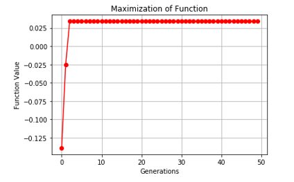

# GeneticAlgorithms
Genetic algorithms have gain popularity recently owing to its similarity to genetic evolution and use in optimization techniques.

You can read the detail for understanding on this link.
https://medium.com/@neelka/genetic-algorithms-for-optimization-77cffeba37ea

Dependencies:
## For Matlab
-Global Optimization Toolbox

## For Python
-Numpy
-Matplot

Evolution Graph

